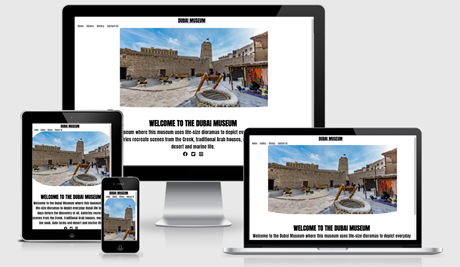

# Dubai Museum
 
 A live website can be found [here]  (https://jervisnoronha.github.io/Dubai-new-full-temeplate/)

This is website talks about the history of Dubai and what it was back in the days. This website is targeted towards people who want to learn and understand the history. Visitors will get acquainted with the different environments of urban and rural lives in Dubai.

### Features 

Navigation bar 
On all four pages there will be navigation bar which include home, gallery, history and contact us page. This section is important because it allows users to quickly visit any section within the site and also allows the users to find the content they’re looking for much faster.  

Hero-image
On the main page there will be a hero-image of the Dubai museum. This image has a catching animation of the image zooming in so that it can grab the visitors attention. 

Information 
The information section will allow users to see the benefits of visiting the museum 

Social media
There will be social media links to all pages on the website. The links will open onto a new tab which will then allow users to reach, nurture and engage.

Gallery 
The photos in the gallery will deliver the visitors information of what is in the museum. This is help to capture the attention of the visitors.

History 
This page talks about the history of the museum and also the most famous things in the museum. This will engage the visitors and teach them a lot about the history and also what each monuments do and what they did back in the days.

Contact us  
This page will allow users to contact us if they are interested about the museum and if they need help finding the museum , if they are then they will have to put in their first name, last name, email address and your message. 

## Testing 

### responsive tool
    I used Am I Responsive to make sure all my pages are working on any device
    (http://ami.responsivedesign.is/)

###### W3C CSS Validation
I used this tool to make sure my css style did not have any errors 
     (https://jigsaw.w3.org/css-validator/)

     

#### W3C Validator Tools
     I used W3C validator to see if there are any errors with my coding 
     (https://validator.w3.org/#validate_by_input+with_options)

     I had a error where i put a space beetween contact us and it notified me about it and i changed it by puttin a _ between contact_us 

     I had a error where for all my heading tags i gave it all a <h1> so i changes that to <h2> and for the others i changes it to a diiferent number.

##### Credits
The text from the home page was taken from tripadvisor
The icons were taking from frontawesome 
(https://fontawesome.com/)

